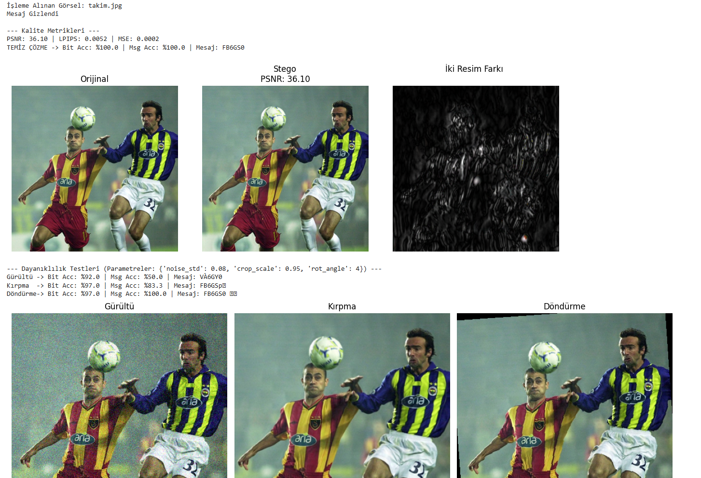
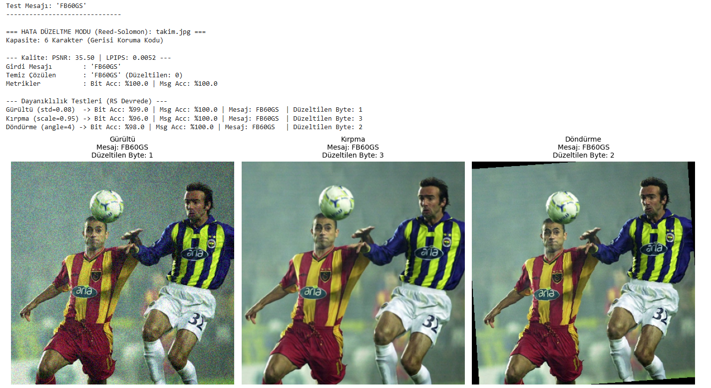
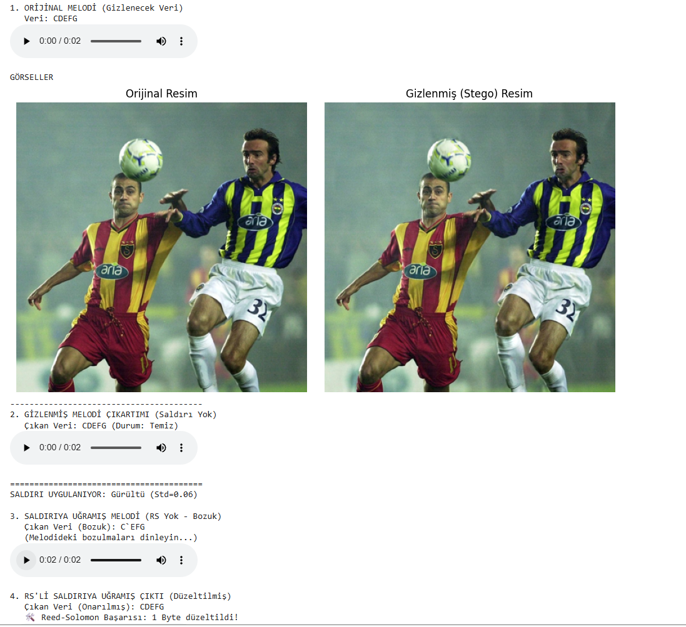

# Transformer and Adversarial-Based Steganography Application

This project is a **practical implementation** inspired by the academic paper:

> **"A Transformer-based Adversarial Network Framework for Steganography"**  
> Chaoen Xiao et al., *Expert Systems With Applications (2025)*

The goal of this project is to **explore the real-world behavior, limitations, and robustness** of transformer-based steganography models and enhance their reliability using **error correction techniques**.

---

## 📌 Project Overview

Steganography aims to hide secret information inside images while preserving:
- **Imperceptibility** (visual similarity to the original image)
- **Robustness** (resistance to noise, cropping, compression, etc.)

This project implements a **Transformer + GAN-based steganography model** and extends it with **Reed–Solomon error correction** to improve message recovery under attacks.

---

## 🧠 Model Architecture

The system consists of three main components:

### 🔹 Encoder (Embedding Network)
- Uses **Transformer (Attention Mechanism)** instead of CNNs
- Learns **global image dependencies**
- Embeds secret messages into visually complex regions
- Skip connections preserve image quality

### 🔹 Decoder (Extraction Network)
- Uses **Spatial Transformer Network (STN)** to correct geometric distortions
- Maintains spatial relationships during message extraction

### 🔹 Discriminator (WGAN)
- Encourages imperceptibility via adversarial training
- Forces the encoder to generate stego images indistinguishable from originals

---

## 🛠 Error Correction with Reed–Solomon

Even small bit errors can corrupt the entire decoded message.

To address this:
- **Reed–Solomon (RS) Error Correction** is applied to the hidden message
- RS enables recovery from **multiple byte-level errors**
- BCH (used in the paper) was replaced with RS due to practical constraints

📌 **Limitation:**  
Due to model architecture constraints, RS can correct up to **4 corrupted bytes** effectively.

---

## 🧪 Experimental Results

### ✔️ No Attack
- **PSNR:** ~35 dB  
- **LPIPS:** ~0.004  
- High visual similarity and accurate decoding

### ✔️ Noise & Cropping Attacks
- Bit accuracy remains high (**~98–99%**)
- Message integrity fails **without ECC**
- Message successfully recovered **with RS enabled**

---

## 🎵 Audio-Based Demonstration

To demonstrate the effectiveness of error correction:
- A melody encoded as text: `CDEFG`
- Converted to audio
- Embedded into an image
- Attacked with noise

| Scenario | Decoded Output |
|--------|----------------|
| Without RS | `SDEFG` ❌ |
| With RS | `CDEFG` ✅ |

---

## 📷 Visual Results

### Stego Image vs Original

### Attack and Recovery

> 📌 *Images are generated from Jupyter Notebook outputs.*

---

## 🚀 Technologies Used

- Python
- PyTorch
- Vision Transformer (ViT)
- GAN / WGAN
- Reed–Solomon Error Correction
- Jupyter Notebook

---

## 📚 References

- Xiao, C. et al. (2025). *A transformer-based adversarial network framework for steganography*
- Official TransStego Repository: https://github.com/Supersirui/TransStego

---

